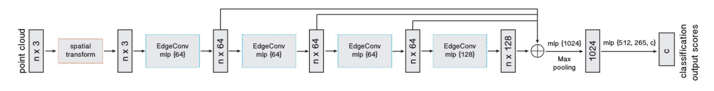

# COMP0248 Coursework 2  

**Group C**  
Yukai Wang, Yiyang Jia, Zewen Qu  
MSc Robotics and Artificial Intelligence,  
Department of Computer Science,  
University College London

**Contact Emails**:  
yukai.wang.24@ucl.ac.uk  
yiyang.jia.24@ucl.ac.uk  
zewen.qu.24@ucl.ac.uk

---

## Project Introduction

This project implements three different pipelines for binary classification and point cloud segmentation on a dataset derived from Sun3D. The task is to determine whether a table is present in a given scene.  

The three pipelines are:

- **Pipeline A**: Depth → Point Cloud → Point Cloud Classification  
- **Pipeline B**: RGB → Depth Estimation → Depth-based Classification  
- **Pipeline C**: Depth → Point Cloud → Point Cloud Segmentation  

---

## Main Features

### Data Collection

Shot with `realsense D455`, parsed using `realsense SDK` for PC, and stored in `.bag` format.

### Data Processing

- **Polygon to Point Cloud Segmentation Labels**: pipeline C 补充

- **Polygon to Classification Labels**: To enable binary classification, we process the original polygon annotations into a simplified JSON format. The `polygon2json.py` script generates a binary label (0/1) for each frame, indicating the presence or absence of any table.

- **Processing Self-Captured RealSense Data**: For self-captured RealSense `.bag` recordings, we extract `aligned RGB`, `depth frames` and `intrinsic parameters` using the `extract.py` script. Then, the `realsense_self_label.py` tool is used to manually annotate frames with classification GT labels (table / no table), stored in the same format JSON file.  

- **Improving RealSense Data Depth Quality**: 补充Depth TSDF做的（后面的代码结构图更新下）


### Pipeline A – Depth → Point Cloud → Classification

- **Depth-to-PointCloud Conversion**: Converts raw depth images into 3D point clouds using the pinhole camera model and camera intrinsics. Each depth image (uint16, in millimeters) is scaled to meters and projected into 3D space. The resulting point clouds are downsampled to a fixed number of points and normalized to a unit sphere.

- **Point Cloud Classification**: Applies a DGCNN-based classifier to the processed point cloud for binary classification (table / no table) from [DGCNN](https://github.com/WangYueFt/dgcnn). The model consists of four EdgeConv layers followed by global feature aggregation and a multi-layer perceptron. The architecture is defined in `src/PipelineA/dgcnn/pytorch/model.py`. And pipeline is implemented in `src/PipelineA/train.py` and `src/PipelineA/evaluation.py`


### Pipeline B – RGB → Depth → Classification

- **Monocular Depth Estimation**: Uses a pre-trained **MiDaS** model with the `vitb_rn50_384` backbone for estimating depth from RGB images.  
  The MiDaS model is obtained from the official repository: [MiDaS GitHub](https://github.com/isl-org/MiDaS.git).
- **Depth-based Classification**: Applies a custom CNN-MLP classifier to the estimated depth map for binary classification (table / no table).  
  The classifier consists of a lightweight convolutional feature extractor followed by an MLP, in `cnn_mlp_classifier.py`.
- This pipeline is implemented in `pipelineB_model.py`, combining MiDaS and `CNNMLPDepthClassifier` as an end-to-end RGB-to-table prediction model.

### Pipeline C – Depth → Point Cloud → Segmentation

- Converts depth to point cloud
- Uses a segmentation model to classify points as table or background
- Evaluates per-point IoU and mIoU for segmentation
- 补充

---

## Model Structure

### Pipeline A
We adopt the Dynamic Graph Convolutional Neural Network (DGCNN) architecture proposed by Wang et al., which has shown strong performance on various point cloud understanding tasks. The network dynamically constructs a $k$-nearest neighbor graph at each layer and applies edge convolution to extract local geometric features. The network architecture is illustrated in figure below, where nubmer of class $c$ is 2, and number of points $n$ is 4096.


### Pipeline B
- A **pre-trained MiDaS** depth estimation model `dpt_hybrid_384`(with a `vitb_rn50_384` backbone) that converts input RGB images into depth maps.
- A custom **CNN-MLP classifier** that takes the estimated depth map as input and predicts whether a table is present.

The MiDaS model is fine-tuned, and the classifier is trained from scratch using the given dataset. The full model is implemented as a unified module in `pipelineB_model.py`.

The structure is illustrated below:


### Pipeline C
补充

## Results

### Pipeline A – Classification on Raw Point Cloud
| Metric     |MIT Dataset| Havard Dataset | Self Realsense Dataset |
|------------|-----------|----------------|------------------------|
| Accuracy   | 0.84      |0.88            | 0.62                   |

#### MIT (Training) Set
- **Accuracy**: 84%
- **Confusion Matrix**:

|               | Predicted Positive | Predicted Negative |
|---------------|--------------------|--------------------|
| Actual Positive | 147                | 13                 |
| Actual Negative | 33                 | 88                 |


#### Harvard (Test 1) Set
- **Accuracy**: 88%
- **Confusion Matrix**:

|               | Predicted Positive | Predicted Negative |
|---------------|--------------------|--------------------|
| Actual Positive | 62                 | 8                  |
| Actual Negative | 4                  | 24                 |


#### RealSense (Test 2) Set
- **Accuracy**: 62%
- **Confusion Matrix**:

|               | Predicted Positive | Predicted Negative |
|---------------|--------------------|--------------------|
| Actual Positive | 28                 | 12                 |
| Actual Negative | 7                  | 3                  |

---

### Pipeline B – Depth Estimation + Classification

Depth Estimation:

| Metric | Havard Dataset | Self Realsense Dataset |
|--------|-------------|------------------------|
| RMSE   |    0.11  | 0.05 |
| MAE    |     0.07  | 0.03 |

Classification:

| Metric     | Havard Dataset | Self Realsense Dataset |
|------------|-------------|------------------------|
| Accuracy   | 0.8776      |0.8200 |
| Precision  | 0.8537      |0.8605 |
| Recall     | 0.9714      | 0.9250 |
| F1 Score   | 0.9211      |  0.8916|

---

### Pipeline C – Point Cloud Segmentation

补充定量metrics，定性可视化的结果啥的

---

## Project Code Structure
The overall structure of the project is shown below：

```
project_root/
├— data/
│   ├— CW2_dataset/                 # Processed Sun3D dataset
│   ├— realsense_testset/         # Final RealSense test set
│   ├— all_polygon_label_dict.json
│   ├— all_realsense_labels.json
│   ├— polygon2label.py           # Converts polygon to binary mask
│   ├— polygon2json.py            # Converts polygon to table/no-table labels
│   ├— extract.py                 # Extract RGBD from .bag file
│   ├— realsense_self_label.py    # Tool for labelling self data
│   └— check_depth.py             # Utility for checking depth images
├— src/
│   ├— PipelineA/                 # Code for Point Cloud Classification
│   ├— pipelineB/                 # Code for RGB → Depth → Classification
│   ├— PipelineC/                 # Code for Point Cloud Segmentation
│   ├— Dataset.py                # Shared Dataset class
│   ├— utils.py                  # Shared utilities (metrics, transforms)
│   └— env_test.py               # Environment testing script
├— results/                      # Output results, logs, visualizations
├— weights/                      # Save best weights for each pipeline
├— requirements.txt
└— README.md
```

Below are the specific structures of each pipeline:

### PipelineA
```
src/PipelineA/
│── dgcnn              # DGCNN model
│── model              # Trained weights
│── train.py           # Training script
│── eval.py            # Evaluation script
```

### pipelineB 
```
src/pipelineB/
├── MiDaS/                     # MiDaS depth estimation model 
├── weights/                   # Pre-trained MiDaS weights
├── classifier_cnn_mlp.py      # CNN + MLP classifier for estimated depth
├── depth_estimator_midas.py   # MiDaS wrapper for RGB-to-depth conversion
├── classifier_mlp.py          # Simple MLP classifier
├── classifier_resnet.py       # ResNet-based depth classifier
├── pipelineB_model.py         # Unified pipeline: depth estimation + classification
├── pipelineBDataLoader.py     # Custom DataLoader for pipelineB based on src/Dataset.py
├── train.py                   # Training script
├── test.py                    # Batch evaluation script
├── test_vis.py                # Visualization: show RGB with predicted label
├── evaluation_class.py        # Classification evaluation metrics (accuracy, precision, recall, F1)
└── evaluation_depth.py        # Depth evaluation metrics (RMSE, MAE)
```

### PipelineC 
补充
```
src/PipelineC/
│── segmenter.py       # Point cloud segmentation model
│── train.py
│── eval.py
│── utils.py           # For point cloud coloring and visualization
```

---

## How to Run

### 1. Install Dependencies

Recommended Python version: **这里到时候确认下**  
Install required packages with:

```bash
pip install -r requirements.txt
```

### 2. Check Dadaset

Make sure the dataset is stored with the correct format in the `data/`:
```
data/
├— realsense_testset/
│   ├— 20250328_104927/           
│   │    ├— depthTSDF/            # store depth image
│   │    ├— image/                # store rgb image
│   │    ├— label.json            # store GT label for classification
│   │    └— intrinsics.txt        # store Realsense D455 internal paras
│   ├— 20250328_105024/
│   ...
```

### 3. Run Pipeline A

```bash
cd coursework_2
python src/PipelineA/train.py
python src/PipelineA/evaluation.py
```


### 4. Run Pipeline B
Make sure the submodule `src/pipelineB/MiDas` is included, which can be downloaded [Here](https://github.com/isl-org/MiDaS)

The best model weights are provided and stored at：

```
weights/pipelineB/best_pipelineB_model.pth
```

Remember to load MiDaS pre-trained weight [dpt_hybrid_384.pt](https://github.com/isl-org/MiDaS/releases/download/v3/dpt_hybrid_384.pt) at:
```
src/pipelineB/weights/
```

Then run the following command to evaluate the model:
```bash
cd coursework_2
python src/pipelineB/test.py
```


### 5. Run Pipeline C

```bash
cd src/PipelineC
补充
```

---

## References
补充下参考的几个模型
- [MiDaS: Accurate Monocular Depth Estimation](https://github.com/isl-org/MiDaS)
- [Sun3D Dataset](https://sun3d.cs.princeton.edu)
- 补充下TSDF 如果有

---

